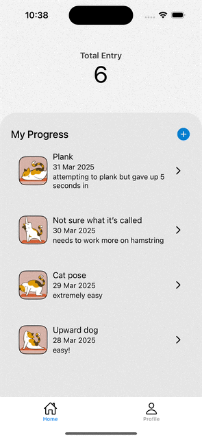
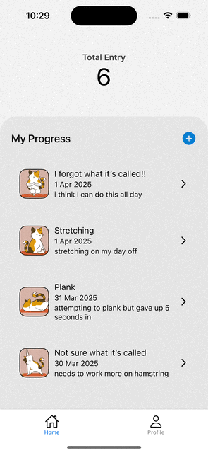

# Progress

Progress is a powerful tracking tool designed to help you document your fitness journey and achieve your goals with ease!

## Environment Set Up

1. Run command in your terminal
   
   ```bash
   git clone git@github.com:samsaem/Progress.git
   ```
   
2. Install dependencies

   ```bash
   npm install
   ```

3. Add Firebase config file `firebase.ts` to directory "config"

   ```ts
   import { initializeApp } from "firebase/app";
   import { initializeAuth, getReactNativePersistence } from "firebase/auth";
   import AsyncStorage from "@react-native-async-storage/async-storage";
   import {getFirestore} from "@firebase/firestore";
   
   const firebaseConfig = {
        // Add web app's Firebase configuration here
   };
   
   const app = initializeApp(firebaseConfig);
   
   export const auth = initializeAuth(app, {
   persistence: getReactNativePersistence(AsyncStorage),
   });
   
   export const firestore = getFirestore(app);
   ```

4. Start Expo and choose your prefer environment (https://expo.dev/go) 

   ```bash
   npx expo start
   ```

In the output, you'll find options to open the app in a

- [development build](https://docs.expo.dev/develop/development-builds/introduction/)
- [Android emulator](https://docs.expo.dev/workflow/android-studio-emulator/)
- [iOS simulator](https://docs.expo.dev/workflow/ios-simulator/)
- [Expo Go](https://expo.dev/go), a limited sandbox for trying out app development with Expo

## App Demo

\-|                Log In/Register                |                     Feed                      | Add Entry
:-------------------------:|:---------------------------------------------:|:---------------------------------------------:|:-------------------------:
**Demo** |  |  | 


## Tools

1. React Native (https://reactnative.dev/)
2. Expo (https://expo.dev/)
3. Expo ImagePicker (https://docs.expo.dev/versions/latest/sdk/imagepicker/)
4. Cloudinary Photo Upload (https://cloudinary.com/documentation/image_upload_api_reference)
5. Google Firebase Firestore (https://firebase.google.com/docs/firestore)
6. Google Firebase Storage (https://firebase.google.com/docs/storage)
7. Google Firebase Authentication (https://firebase.google.com/docs/auth)